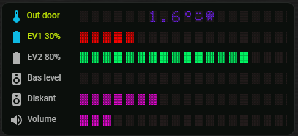

# Andy Segment Display Card V2.0.7

### 7-segment mode (numeric) Dot-matrix mode (text) & Plain text




> **Recommended installation method:** HACS  
> Manual installation is supported but not recommended unless HACS is unavailable.

A Home Assistant Lovelace custom card that renders an entity state in a classic digital display style, and now support multiple entities / rows / slides and progressbar

- 7-segment mode for numeric values (calculator/thermometer look)
- 5x7 dot-matrix mode for text states

The card includes a visual editor (entity picker + styling options) and is designed to look great on dashboards where you want a clear, “LCD-style” readout.

Features:
- Select any entity (standard Home Assistant entity picker)
- Two render styles:
-- 7-segment (digits): digits, minus, decimal dot
-- Dot-matrix (text): renders text in a 5x7 matrix font

- Styling options:
-- Text color and background color
-- Optional “unused segments” (faint segments) in 7-segment mode
-- Dot ON/OFF colors in matrix mode (ON can inherit text color)

- Formatting:
-- Optional decimals for numeric states
-- Optional unit display (e.g. °C)
-- Max characters to display

- Safe multi-card usage:
- Instance-scoped CSS prevents multiple cards from affecting each other

## v2.0.7
- Added Title + Icon inline (same row) as value / progressbar
- Added reserve title + icon space if Inline
- Added segment GAP setting
- Color intervals match value or number
- Added several dot matrix symbols
- Showing unused segments in both 7-segment and Dot Matrix mode
- Added "fixed" segments in animation, smoother animation
- Optimisation of animation loops


## v2.0.6
- Added support for Timer entity, such as Remaining time. Attribute to shown via dropdown if entity = timer.
- Added new Dot Matrix symbols: House, lightniing, lightbulb, battery
- Added support for showing % and # in dot matrix


## v2.0.5
- Added support for GAP between title and Icon
- Added Color picker for Title aand Icon
- Added interval color selection on progressbar (show all or active interval)


## v2.0.4
- Added Multiple ROW Support! 
- Added support for special characters (scroll down
- Added support for unit with both lowercase / uppercase
- Showing unused matrix dots
- Added support for Progressbar on numeric values
- Added support for showing icon in Title, can be left / right aligned

## v2.0 
- Multi-entity support (Slides): rotate between multiple entities instead of showing only one
- Slide-based animation engine: configurable In / Stay / Out timing per slide
- Multiple animation styles: Left, Right, Top, Bottom, Billboard, Matrix, and Running
- Continuous Running mode: scrolling text that flows left → right without stopping
- Per-slide value templates: mix static text with <value> placeholders
- Color Intervals: dynamic text color based on numeric value ranges
- Global render settings: shared style, size, colors, alignment across all slides
- Plain Text render mode: in addition to Dot-Matrix and 7-Segment
- Italic text support (Plain Text + 7-Segment)
- Center text option
- Improved Visual Editor: structured Slides list with Add / Move / Delete controls
- Backwards compatibility: automatic migration from old single-entity YAML
- 7-Segment letter support: displays C, F, L, I (e.g., °C / °F units)
- Animations work even with a single slide
- Improved color picker stability: no focus loss while editing
- Enhanced editor layout: Slides list separated for better readability
- More robust architecture: animation logic split into modular functions for future expansion

Configuration
All options are available in the visual editor. YAML mode is also supported.


## ☕ Support the project 
I’m a Home Automation enthusiast who spends way too many late nights building custom cards, dashboards and small tools for Home Assistant.
I love creating clean, useful UI components and sharing them for free with the community, and I try to help others whenever I can with ideas, code and support.
If you enjoy my work or use any of my cards in your setup, your support means a lot and helps me keep experimenting, improving and maintaining everything.

<a href="https://www.buymeacoffee.com/AndyBonde" target="_blank">
  
</a>


## Installation

### Option A — Install via HACS (published repository)
1. Open **HACS** in Home Assistant.
2. Go to **Frontend**.
3. Search for **Andy segment display**.
4. Open the card and click **Download**.
5. Restart Home Assistant (or reload frontend resources).

After installation, the Lovelace resource is usually added automatically by HACS.  
If not, see **“Add as a resource”** below.

---

### Option B — Install via HACS (custom repository)
Use this method if the card is not yet listed in the HACS store.

1. Open **HACS** in Home Assistant.
2. Click the **⋮ (three dots)** menu in the top right.
3. Select **Custom repositories**.
4. Add the repository:
   - **Repository**: `https://github.com/maglerod/andy-segment-display-card`
   - **Category**: **Lovelace**
5. Click **Add**.
6. Go to **Frontend** in HACS.
7. Search for **Andy Segment Display**.
8. Click **Download**.
9. Restart Home Assistant (or reload frontend resources).

---

### Option C — Manual installation (no HACS)
1. Download `andy-segment-display-card.js` from this repository.
2. Copy the file to your Home Assistant configuration directory: /config/www/andy-segment-display-card.js

### Add as a resource (if needed)
If the card does not appear automatically:

1. Go to **Settings → Dashboards → Resources**
2. Click **Add Resource**
3. Enter:
- **URL**: `/local/andy-segment-display-card.js?v=20260101-123`
- **Resource type**: `JavaScript Module`
4. Save and perform a **hard refresh** in your browser (`Ctrl+F5` / `Cmd+Shift+R`).


---

### Add the card to a dashboard

#### Using the UI editor
1. Open your dashboard → **Edit dashboard**
2. Click **Add card**
3. Search for **Andy Segment Display**
4. Configure the card and save

#### Using YAML
```yaml
type: custom:andy-segment-display-card
entity: sensor.your_sensor_here
title: ""
size_px: 0
text_color: "#00FF66"
background_color: "#0B0F0C"
show_unused: true
unused_color: "#2A2F2C"
decimals: null
show_unit: false
max_chars: 10
render_style: segment
matrix_dot_off_color: "#1C211E"
matrix_dot_on_color: ""
matrix_cols: 5
matrix_rows: 7
matrix_gap: 2

```


#### Segments with progressbar example
```yaml
type: custom:andy-segment-display-card
render_style: matrix
size_px: 12
italic: false
center_text: true
show_title: true
background_color: "#0B0F0C"
text_color: "#00FF66"
title_color: ""
matrix_dot_off_color: "#221B1B"
matrix_dot_on_color: ""
show_unused: true
unused_color: "#2A2F2C"
max_chars: 20
color_intervals:

from: 0
to: 20
color: "#FF0000"
from: 20
to: 30
color: "#FF9500"
from: 30
to: 70
color: "#F7FB09"
from: 70
to: 100
color: "#00FF66"
matrix_cols: 5
matrix_rows: 7
matrix_gap: 2
segment_gap_px: 6
title_inline: false
title_inline_width: 160
rows:
slides:
animate_single: false
timer_mode: remaining
entity: sensor.andypandypro_watch_battery_level
title: EV1
title_icon: mdi:car-battery
title_icon_align: left
title_icon_gap: 14
title_text_color: "#cef604"
title_icon_color: "#ffc800"
decimals: null
auto_decimals: null
leading_zero: true
show_unit: false
color_intervals: []
value_template:
matrix_progress: true
progress_min: 0
progress_max: 100
progress_color_mode: intervals
stay_s: 3
out_s: 0.5
in_s: 0.5
fade: false
show_style: run_left
hide_style: run_right
hide_prev_first: false
is_default: true
is_default: false
slides:
animate_single: false
timer_mode: ""
entity: sensor.andypandypro_battery_level
title: EV2
title_icon: mdi:car-battery
title_icon_align: left
title_icon_gap: 6
title_text_color: "#d3fb09"
title_icon_color: "#ffc800"
decimals: 0
auto_decimals: null
leading_zero: true
show_unit: false
color_intervals: []
value_template:
matrix_progress: true
progress_min: 0
progress_max: 100
progress_color_mode: intervals
stay_s: 3
out_s: 0.5
in_s: 0.5
fade: true
show_style: run_left
hide_style: run_right
hide_prev_first: true

```


